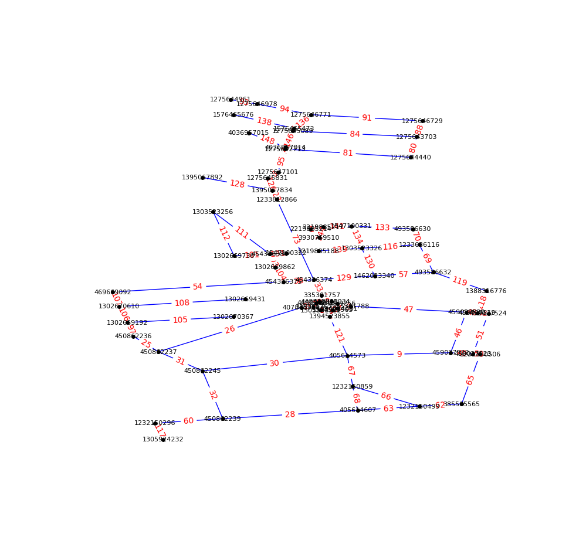

### Envirement setup

```
python -m venv .

source bin/activate

pip install -r requirements.txt
```

### Running scripts

```
# Run main script
python main.py

# Output
Generate graph: Graph with 69 nodes and 86 edges
Basic characteristics of the graph:
Number of vertices (nodes): 69
Number of edges (edges): 86
Average degree of vertices: 2.49
The graph is connected: Yes
The diameter of the graph: 20
Vertex with maximum centrality: 405614573

Data successfully written to cache/d3_data.json
Data successfully written to cache/dfs_visited_nodes.json

DFS traversal order starting from node 405614573 (172 steps)
Data successfully written to cache/bfs_visited_nodes.json

BFS traversal order starting from node 405614573 (86 steps)
dfs_path [405614573, 459027522, 459027520, 335301788, 401359256, 448838034, 335301757, 448838041, 448838042, 407848990, 450862237, 450862236, 1302669192, 1302670610, 1302669431]

Found the path DFS (len=15): [405614573, 459027522, 459027520, 335301788, 401359256, 448838034, 335301757, 448838041, 448838042, 407848990, 450862237, 450862236, 1302669192, 1302670610, 1302669431]
Found the path BFS (len=7): [405614573, 450862245, 450862237, 450862236, 1302669192, 1302670610, 1302669431]

Function call for vertex 405614573 [127, 103, 102, 173, 106] ...
Function call for vertex 1302669431 [340, 378, 369, 552, 365] ...

```



### Conclusion [EN](conclusions_en.md) [UK](conclusions_uk.md)

### Algorithm Visualization (experimental version)

- [DFS (Depth-First Search)](https://antmuraha.github.io/goit-algo-hw-06/animation.html?speed=500&visited_nodes_data=dfs_visited_nodes) and [DFS Algorithm Visualization](https://antmuraha.github.io/goit-algo-hw-06/images/dfs_algorithm_visualization.webm)
- [BSF (Breadth-First Search)](https://antmuraha.github.io/goit-algo-hw-06/animation.html?speed=500&visited_nodes_data=bfs_visited_nodes) and [BFS Algorithm Visualization](https://antmuraha.github.io/goit-algo-hw-06/images/bfs_algorithm_visualization.webm)

### Local development

```
# Start local server
python3 -m http.server 3000 | sed -e 's/^$/Access-Control-Allow-Origin: */'

http://127.0.0.1:3000/animation.html?speed=500&visited_nodes_data=dfs_visited_nodes
http://127.0.0.1:3000/animation.html?speed=500&visited_nodes_data=bfs_visited_nodes
```

### The following tools were used:

1. Convenient retrieval of bbox data http://bboxfinder.com/
2. Generate network from OpenStreetMap with osmnx https://github.com/gboeing/osmnx
